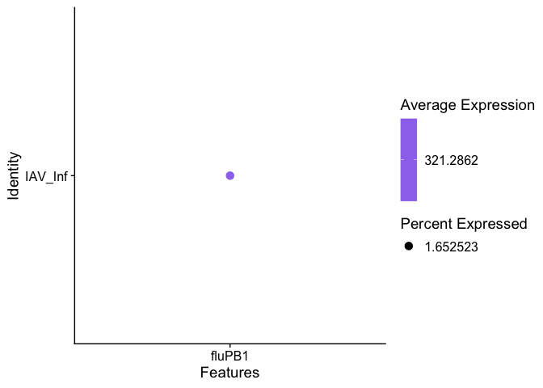
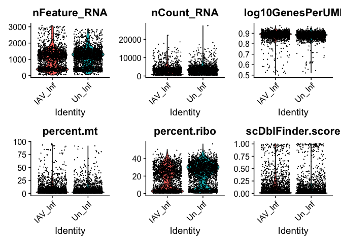
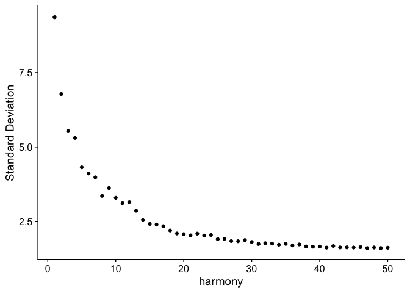
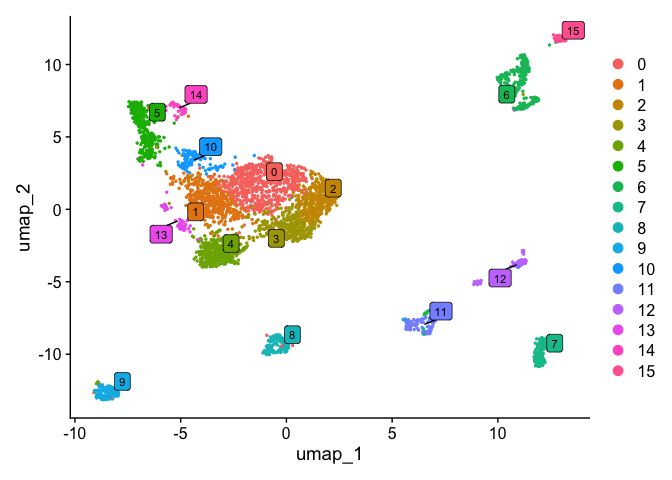
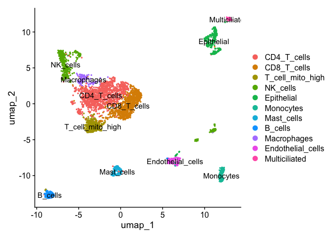

Single-Cell RNA-seq Analysis of Human Lung (HuLu) with IAV Infection
================
Your Name

# Chunk 1: Load packages and set working directory

``` r
Un_Inf <- Read10X('/Users/aj397/Documents/Data/HuLu 10X 2023/N1468/filtered_feature_bc_matrix')
IAV_Inf <- Read10X('/Users/aj397/Documents/Data/HuLu 10X 2023/N1469/filtered_feature_bc_matrix')

Un_Inf <- CreateSeuratObject(counts = Un_Inf, project = "Un_Inf", min.cells = 1, min.features = 1)
Un_Inf[["percent.mt"]] <- PercentageFeatureSet(object = Un_Inf, pattern = "^MT-")
sce1 <- as.SingleCellExperiment(Un_Inf)
```

    ## Warning: Layer 'data' is empty

    ## Warning: Layer 'scale.data' is empty

``` r
#This step runs doublet detection and puts a probability of being a doublent in the metadata as "scDblFinder.score"
sce1 <- scDblFinder(sce1)
```

    ## Creating ~2362 artificial doublets...

    ## Dimensional reduction

    ## Evaluating kNN...

    ## Training model...

    ## iter=0, 267 cells excluded from training.

    ## iter=1, 229 cells excluded from training.

    ## iter=2, 220 cells excluded from training.

    ## Threshold found:0.445

    ## 160 (5.4%) doublets called

``` r
Un_Inf[['scDblFinder.score']]<-sce1$scDblFinder.score
Un_Inf[['scDblFinder.class']]<-sce1$scDblFinder.class

cutoff <- sum(quantile(Un_Inf@meta.data$nFeature_RNA, probs = c(0.75)), iqr(Un_Inf@meta.data$nFeature_RNA)*1.5)
Un_Inf <- subset(Un_Inf, subset = nFeature_RNA < cutoff)

rm(sce1)


# Chunk 3: Read and preprocess IAV infected sample
```

``` r
IAV_Inf <- CreateSeuratObject(counts = IAV_Inf, project = "IAV_Inf", min.cells = 1, min.features = 1)

DotPlot(IAV_Inf, assay = "RNA", features = "fluPB1", )
```

    ## Warning: No layers found matching search pattern provided

    ## Warning in FetchData.Assay5(object = object[[DefaultAssay(object = object)]], : data
    ## layer is not found and counts layer is used

    ## Warning: Only one identity present, the expression values will be not scaled

<!-- -->

``` r
IAV_Inf[["percent.mt"]] <- PercentageFeatureSet(object = IAV_Inf, pattern = "^MT-")
sce1 <- as.SingleCellExperiment(IAV_Inf)
```

    ## Warning: Layer 'data' is empty

    ## Warning: Layer 'scale.data' is empty

``` r
sce1 <- scDblFinder(sce1)
```

    ## Creating ~1792 artificial doublets...

    ## Dimensional reduction

    ## Evaluating kNN...

    ## Training model...

    ## iter=0, 186 cells excluded from training.

    ## iter=1, 198 cells excluded from training.

    ## iter=2, 194 cells excluded from training.

    ## Threshold found:0.665

    ## 117 (5.2%) doublets called

``` r
IAV_Inf[['scDblFinder.score']]<-sce1$scDblFinder.score
IAV_Inf[['scDblFinder.class']]<-sce1$scDblFinder.class

cutoff <- sum(quantile(IAV_Inf@meta.data$nFeature_RNA, probs = c(0.75)), iqr(IAV_Inf@meta.data$nFeature_RNA)*1.5)
IAV_Inf <- subset(IAV_Inf, subset = nFeature_RNA < cutoff)

rm(sce1)


# Chunk 4: Merge and QC metrics
```

``` r
HuLu <- merge(x=Un_Inf, y=c(IAV_Inf))


HuLu[["percent.ribo"]] <- PercentageFeatureSet(object = HuLu, pattern = "^RP[SL]")
HuLu[['percent.HB']]<- PercentageFeatureSet(object = HuLu, pattern = "^HB[^(P)]")
HuLu[['log10GenesPerUMI']] <- log10(HuLu$nFeature_RNA) / log10(HuLu$nCount_RNA)
s.genes <- cc.genes.updated.2019$s.genes
g2m.genes <- cc.genes.updated.2019$g2m.genes


VlnPlot(object = HuLu, features = c("nFeature_RNA", "nCount_RNA",'log10GenesPerUMI', "percent.mt", "percent.ribo", "scDblFinder.score"),ncol = 3, group.by = "orig.ident", pt.size = 0.01)
```

    ## Warning: Default search for "data" layer in "RNA" assay yielded no results; utilizing
    ## "counts" layer instead.

<!-- -->

``` r
HuLu <- subset(x = HuLu, subset = nFeature_RNA > 350 & nCount_RNA > 600 & percent.mt < 25 & log10GenesPerUMI >0.7)


# Chunk 5: Normalization, variable features, PCA
```

``` r
HuLu <- NormalizeData(HuLu) %>% 
  FindVariableFeatures() %>% 
  ScaleData() %>% 
  RunPCA()
```

    ## Normalizing layer: counts.Un_Inf

    ## Normalizing layer: counts.IAV_Inf

    ## Finding variable features for layer counts.Un_Inf

    ## Finding variable features for layer counts.IAV_Inf

    ## Centering and scaling data matrix

    ## PC_ 1 
    ## Positive:  CD69, IL7R, RGS1, CCL5, CLEC2B, KLRB1, CCL4, TRBC1, MT-CO3, DDIT4 
    ##     NKG7, GNLY, GZMB, CD8A, PRF1, MT-CYB, CREM, GZMA, ICOS, CD40LG 
    ##     CTLA4, CMC1, CXCR6, GIMAP7, KLRC1, TRGC2, LINC02446, LY9, MALAT1, TRGC1 
    ## Negative:  SDC4, GPRC5A, ELF3, CLDN4, KRT19, KRT8, TACSTD2, EPCAM, CD9, KRT18 
    ##     PRSS8, EMP2, SPINT2, MAL2, WFDC2, TM4SF1, SFTA2, NAPSA, NEDD4L, RNASE1 
    ##     EFNA1, IFITM3, MUC1, S100A14, NUPR1, CEBPD, ERRFI1, MGST1, CLDN7, LAMB3 
    ## PC_ 2 
    ## Positive:  LYZ, CD163, CD14, VCAN, FCGR2B, THBS1, PLAUR, FCGR2A, AIF1, CLEC7A 
    ##     CD86, CXCL8, FCER1G, SLC11A1, TYROBP, MS4A7, EREG, CD68, BASP1, KYNU 
    ##     C5AR1, MAFB, TIMP1, VSIG4, EPB41L3, IL1R2, SPI1, S100A8, GPNMB, S100A9 
    ## Negative:  ELF3, CLDN4, TACSTD2, KRT8, HOPX, PERP, MAL2, IL7R, WFDC2, KRT18 
    ##     LMO7, KRT19, GPRC5A, CLDN3, EPCAM, SFTPB, CLDN7, PRSS8, TMC5, SFTA2 
    ##     NAPSA, KRT7, SLC34A2, MUC1, IFT57, ATP1B1, LAMB3, EHF, DSTN, NKX2-1 
    ## PC_ 3 
    ## Positive:  C5orf49, FAM183A, TMEM190, RSPH1, CAPS, C20orf85, PIFO, CCDC170, TSPAN1, CETN2 
    ##     CLDN3, C9orf24, FAM81B, ZMYND10, MLF1, MORN2, TPPP3, DNAH11, C1orf194, DNAAF1 
    ##     DNALI1, C9orf116, CCDC78, CABCOCO1, ODF3B, TEKT2, FAM92B, MAPK15, MOK, CFAP157 
    ## Negative:  NAPSA, SFTPA2, SFTPB, SFTPA1, PGC, SLC34A2, SFTA2, SFTPD, PEBP4, SFTPC 
    ##     S100A14, C3, ABCA3, C11orf96, SCD, C2, CXCL17, SLC22A31, CRTAC1, SERPINA1 
    ##     MALL, SDR16C5, C4BPA, DRAM1, NRGN, SLPI, ALPL, MPZL2, PRSS8, PDZK1IP1 
    ## PC_ 4 
    ## Positive:  SERPINA1, CSF3R, ACSL1, CXCL17, SLPI, S100A9, SFTPA2, NAPSA, PGC, PIGR 
    ##     SFTPA1, CXCL8, CTSH, MGST1, SLC34A2, SFTPB, MUC1, SFTPD, NPC2, WFDC2 
    ##     TREM1, C2, SLC11A1, IL1R2, C3, SFTPC, BCL2A1, S100A8, ABCA3, TLR2 
    ## Negative:  CALCRL, CLDN5, SERPINE1, SPARCL1, DEPP1, PODXL, TIMP3, GPX3, AKAP12, SPARC 
    ##     SRPX, EGFL7, TGM2, TCF4, COX7A1, ADGRL4, CRIP2, MGP, CDH5, PLAT 
    ##     SLCO4A1, VWF, KANK3, CLIC4, CALD1, PTGIS, PECAM1, PTPRB, GNG11, FLT1 
    ## PC_ 5 
    ## Positive:  TFPI, SCD, NRGN, CXCL17, C3, C1R, PIGR, IGFBP4, C2, CRTAC1 
    ##     SFTPA2, ABCA3, SLC22A31, ARFGEF3, LRP2, SERPINA1, C11orf96, SFTPA1, CP, FASN 
    ##     NNMT, EPHX1, MT-ATP6, SFTPC, SELENOP, FADS1, MT-CO3, PGC, LAMP3, MACROD2 
    ## Negative:  AGER, CLDN18, ANKRD1, CRYAB, CEACAM6, KRT7, SCEL, TENT5B, CAV1, EDN1 
    ##     UPK3B, GADD45B, GJA1, HSPB8, CGN, FSTL3, EMP2, ANXA3, SCNN1G, SFN 
    ##     KLF10, SEMA3B, MYL9, KLK11, NRG1, COL4A1, MYRF, ICAM1, CAV2, TNFRSF12A

``` r
# Chunk 6: Cell cycle + Harmony
```

``` r
HuLu <- JoinLayers(HuLu)
HuLu <- CellCycleScoring(HuLu, s.features = s.genes, g2m.features = g2m.genes, set.ident = TRUE)

HuLu <- RunHarmony(HuLu, group.by.vars = c("orig.ident", "Phase"))
```

    ## Transposing data matrix

    ## Initializing state using k-means centroids initialization

    ## Harmony 1/10

    ## Harmony 2/10

    ## Harmony 3/10

    ## Harmony converged after 3 iterations

``` r
ElbowPlot(HuLu, ndims = 50, reduction = 'harmony')
```

<!-- -->

``` r
# Chunk 7: UMAP + clustering
```

``` r
HuLu <- FindNeighbors(HuLu, reduction = 'harmony', dims = 1:50) 
```

    ## Computing nearest neighbor graph

    ## Computing SNN

``` r
HuLu <- RunUMAP(HuLu, reduction = 'harmony', dims = 1:50)
```

    ## Warning: The default method for RunUMAP has changed from calling Python UMAP via reticulate to the R-native UWOT using the cosine metric
    ## To use Python UMAP via reticulate, set umap.method to 'umap-learn' and metric to 'correlation'
    ## This message will be shown once per session

    ## 21:43:35 UMAP embedding parameters a = 0.9922 b = 1.112

    ## 21:43:35 Read 3856 rows and found 50 numeric columns

    ## 21:43:35 Using Annoy for neighbor search, n_neighbors = 30

    ## 21:43:35 Building Annoy index with metric = cosine, n_trees = 50

    ## 0%   10   20   30   40   50   60   70   80   90   100%

    ## [----|----|----|----|----|----|----|----|----|----|

    ## **************************************************|
    ## 21:43:36 Writing NN index file to temp file /var/folders/8h/nlcjp3m90839bs8hs2n2jvx40000gp/T//Rtmp5adogB/file1230e49c9bd2e
    ## 21:43:36 Searching Annoy index using 1 thread, search_k = 3000
    ## 21:43:37 Annoy recall = 100%
    ## 21:43:38 Commencing smooth kNN distance calibration using 1 thread with target n_neighbors = 30
    ## 21:43:39 Initializing from normalized Laplacian + noise (using RSpectra)
    ## 21:43:39 Commencing optimization for 500 epochs, with 167236 positive edges
    ## 21:43:45 Optimization finished

``` r
HuLu <- FindClusters(HuLu, resolution = 0.8)
```

    ## Modularity Optimizer version 1.3.0 by Ludo Waltman and Nees Jan van Eck
    ## 
    ## Number of nodes: 3856
    ## Number of edges: 178836
    ## 
    ## Running Louvain algorithm...
    ## Maximum modularity in 10 random starts: 0.8454
    ## Number of communities: 16
    ## Elapsed time: 1 seconds

``` r
DimPlot(HuLu, label = T,
        label.box = TRUE,
        label.size = 3,
        repel = TRUE)
```

<!-- -->

``` r
# Chunk 8: Marker analysis + plots
```

``` r
#Defining Clusters
#Cluster 0 = CD4 T cells
print(c("CD53", "PTPRC", "CORO1A", "ISG20", "CCL5", "CD40LG", "TNFRSF25", 
                   "CD28", "CD4", "TRAT1")
            , order = T)
```

    ##  [1] "CD53"     "PTPRC"    "CORO1A"   "ISG20"    "CCL5"     "CD40LG"   "TNFRSF25"
    ##  [8] "CD28"     "CD4"      "TRAT1"

``` r
#Cluster 1 = CD4 T cells
print(c("CD53", "PTPRC", "CORO1A", "ISG20", "CCL5", "CD40LG", "TNFRSF25", 
                   "CD28", "CD4", "TRAT1")
            , order = T)
```

    ##  [1] "CD53"     "PTPRC"    "CORO1A"   "ISG20"    "CCL5"     "CD40LG"   "TNFRSF25"
    ##  [8] "CD28"     "CD4"      "TRAT1"

``` r
#Cluster 2 = CD8 T cells
print(c("CD53", "CD53", "PTPRC", "CORO1A", "ISG20", "CCL5", "CD8A", 
                   "CD8B", "TRGC2")
            , order = T)
```

    ## [1] "CD53"   "CD53"   "PTPRC"  "CORO1A" "ISG20"  "CCL5"   "CD8A"   "CD8B"   "TRGC2"

``` r
#Cluster 3 = CD8 T cells

print(c("CD53", "CD53", "PTPRC", "CORO1A", "ISG20", "CCL5", "CD8A", 
                   "CD8B", "TRGC2")
            , order = T)
```

    ## [1] "CD53"   "CD53"   "PTPRC"  "CORO1A" "ISG20"  "CCL5"   "CD8A"   "CD8B"   "TRGC2"

``` r
#Cluster 4 = T cells with high mitochondrial reads

print( c('TRAC','percent.mt'), order = T)
```

    ## [1] "TRAC"       "percent.mt"

``` r
#Cluster 5 = NK cells
print(c("CD53", "PTPRC", "CORO1A", "NCAM1", "CCL5", "GNLY", "SPON2", 
                   "FCGR3A")
            , order = T)
```

    ## [1] "CD53"   "PTPRC"  "CORO1A" "NCAM1"  "CCL5"   "GNLY"   "SPON2"  "FCGR3A"

``` r
#Cluster 6 = Secretory Epithelium
print( c(
  'KRT8','SCGB1A1','EPCAM','MUC1',
  "FXYD3", "ELF3", "IGFBP2", "SERPINF1", "TSPAN1"), order = T)
```

    ## [1] "KRT8"     "SCGB1A1"  "EPCAM"    "MUC1"     "FXYD3"    "ELF3"     "IGFBP2"  
    ## [8] "SERPINF1" "TSPAN1"

``` r
#Cluster 7 = Monocyte
print( c("CD53", "PTPRC", "CORO1A", "FCER1G", "C1orf162", "CLEC7A", 
                    "S100A12", "FCN1", "CD14"), order = T)
```

    ## [1] "CD53"     "PTPRC"    "CORO1A"   "FCER1G"   "C1orf162" "CLEC7A"   "S100A12" 
    ## [8] "FCN1"     "CD14"

``` r
#Cluster 8 = Mast cells
print( c("MS4A2", "SLC18A2", "RGS13"), order = T)
```

    ## [1] "MS4A2"   "SLC18A2" "RGS13"

``` r
#Cluster 9 = B cells
print( c("MS4A1"), order = T)
```

    ## [1] "MS4A1"

``` r
#Cluster 10 = Macrophages
print( c("CYP27A1", "MARCO", "FABP4"), order = T)
```

    ## [1] "CYP27A1" "MARCO"   "FABP4"

``` r
#Cluster 11 = Endothelial cells
print( c("CLDN5", "ECSCR", "CLEC14A", "CCL21", "TFF3", "MMRN1", "LYVE1", 
                    "CCL21"), order = T)
```

    ## [1] "CLDN5"   "ECSCR"   "CLEC14A" "CCL21"   "TFF3"    "MMRN1"   "LYVE1"   "CCL21"

``` r
#Cluster 12 = NK cells
print(c("CD53", "PTPRC", "CORO1A", "ISG20", "CCL5", "GNLY", "SPON2", 
                   "FCGR3A"))
```

    ## [1] "CD53"   "PTPRC"  "CORO1A" "ISG20"  "CCL5"   "GNLY"   "SPON2"  "FCGR3A"

``` r
#Cluster 13 = CD4 T cells
print(c("CD53", "PTPRC", "CORO1A", "ISG20", "CCL5", "CD40LG", "TNFRSF25", 
                   "CD28", "CD4", "TRAT1"))
```

    ##  [1] "CD53"     "PTPRC"    "CORO1A"   "ISG20"    "CCL5"     "CD40LG"   "TNFRSF25"
    ##  [8] "CD28"     "CD4"      "TRAT1"

``` r
#Cluster 14 = NK cells
print(c("CD53", "PTPRC", "CORO1A", "ISG20", "CCL5", "GNLY", "SPON2", 
                   "FCGR3A")
            , order = T)
```

    ## [1] "CD53"   "PTPRC"  "CORO1A" "ISG20"  "CCL5"   "GNLY"   "SPON2"  "FCGR3A"

``` r
#Cluster 15 = Multiciliated

print( c("RSPH1", "C9orf24", "C20orf85"), order = T)
```

    ## [1] "RSPH1"    "C9orf24"  "C20orf85"

``` r
new.cluster.ids <- c('CD4_T_cells', 'CD4_T_cells', 'CD8_T_cells',
                     'CD8_T_cells','T_cell_mito_high', "NK_cells", "Epithelial",
                     "Monocytes", 'Mast_cells', 'B_cells', 'Macrophages',
                     'Endothelial_cells', "NK_cells" , 'CD4_T_cells',
                     "NK_cells" , 'Multiciliated')
names(x = new.cluster.ids) <- levels(HuLu)
HuLu <- RenameIdents(object = HuLu, new.cluster.ids)
HuLu[["Cell.ID"]] <- Idents(object = HuLu)

Idents(HuLu)<-'Cell.ID'
DimPlot(HuLu, label = T) 
```

<!-- -->
